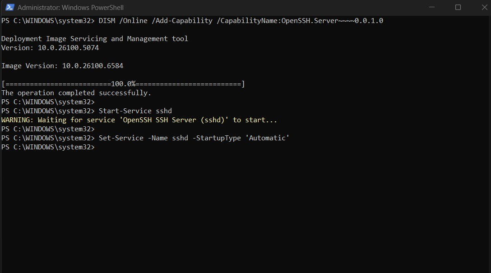
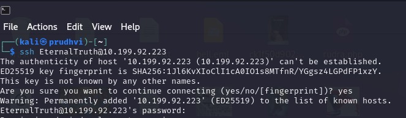
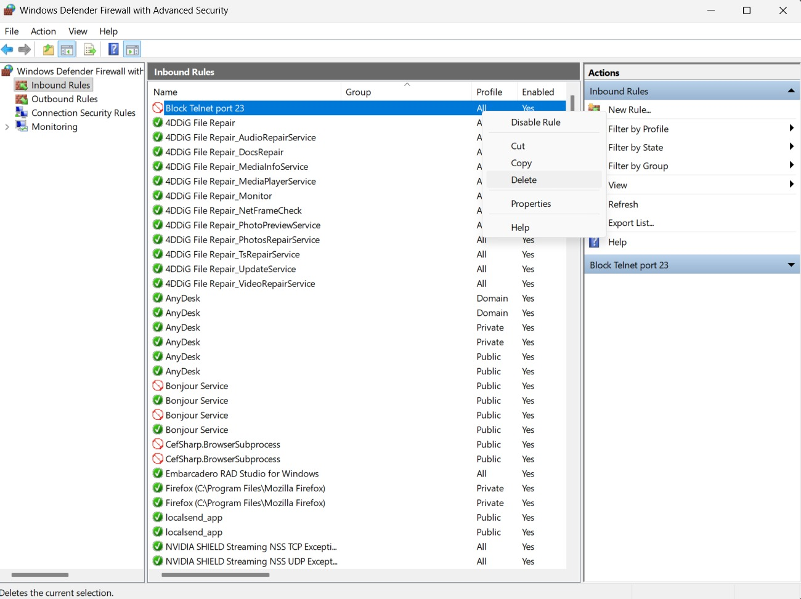
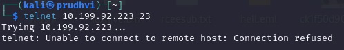
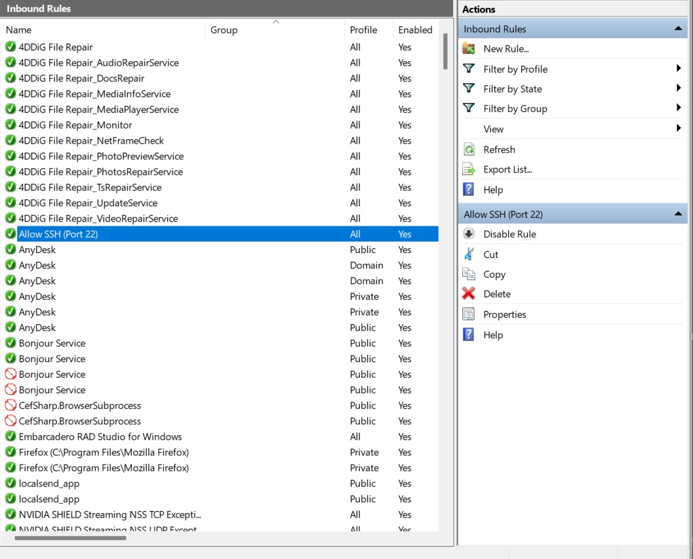
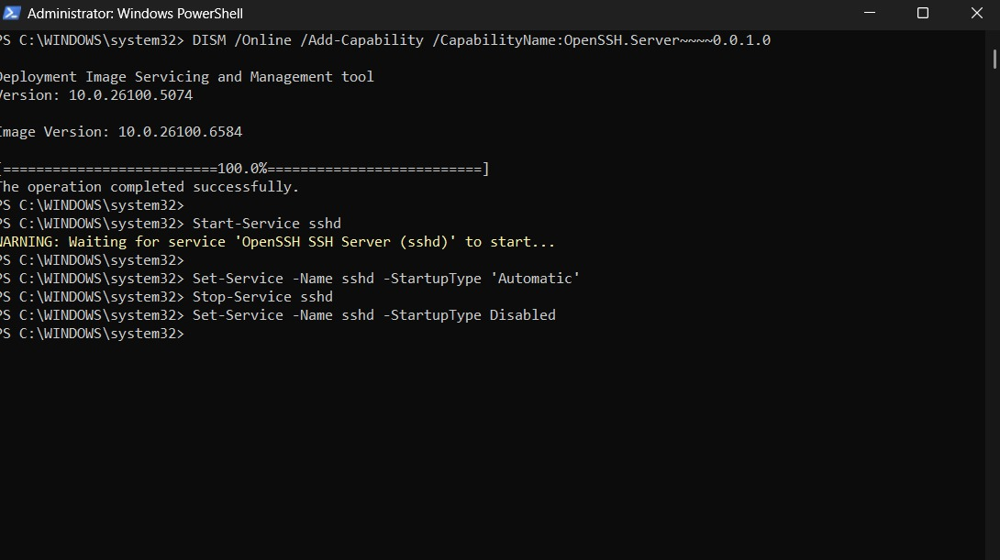

# Windows/Linux Firewall Setup & Testing Lab

## Objective

Configure and test firewall rules on Windows to allow/deny specific traffic using Windows Defender Firewall. Document the steps, applied rules, and verification commands with supporting screenshots.

---

## Step 1: Install and Start SSH Server (Windows)

**Command:**

DISM /Online /Add-Capability /CapabilityName:OpenSSH.Server~~~~0.0.1.0
```
Start-Service sshd
```


---

## Step 2: SSH from Kali to Windows

**Command:**
```
ssh EternalTruth@10.199.92.223
```


---

## Step 3: Block Inbound Telnet (Port 23)

- Open Windows Defender Firewall > Inbound Rules
- Create a new rule to block port 23 (Telnet)




---

## Step 4: Try to Access Telnet (Blocked)

**Command (on Kali):**
```
telnet 10.199.92.223 23
```


---

## Step 5: Allow SSH (Port 22) Rule

- Add a rule in Windows Defender Firewall to explicitly allow port 22 (SSH)




---

## Step 6: Test SSH Access

**Command (on Kali):**
```
ssh EternalTruth@10.199.92.223
```


---

## Step 7: Remove/Disable Test Rules

- Right click the block/allow rules and select “Delete”


---

## Step 8: Testing SSHD Service Management
```
Set-Service -Name sshd -StartupType Disabled
```
```
Stop-Service sshd
```
```
Start-Service sshd
```


---

## Step 9: Example Error (Optional, if occurred)


---

## Conclusion

This lab demonstrates the process of applying, verifying and removing Windows firewall rules for specific ports, validating using external connection attempts, and documenting all steps with screenshots.

---

## Notes on Markdown Image Embedding

- Use relative paths to images in your repository, like ``
- Upload all screenshots to the root directory or an `images/` folder in your repo and update paths accordingly.

---


